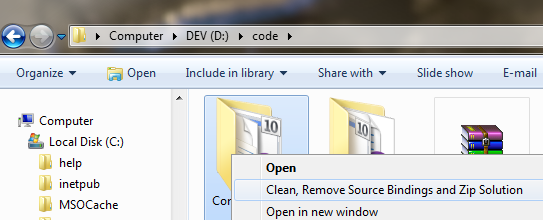
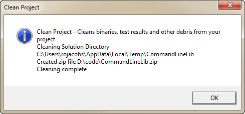

# CleanProject
A copy of the code from [CleanProject - Cleans Visual Studio Solutions For Uploading or Email](https://code.msdn.microsoft.com/Clean-Cleans-Visual-Studio-a05bca4f)

#Introduction
Clean Project is a utility that cleans Visual Studio project directories so you can quickly upload or email a zip file with your solution.

How many times have you wanted to send a project to a friend or upload it to a web site like MSDN Code Gallery only to find that your zip file has lots of stuff that you don't need to send in it making the file larger than it needs to be.

  * bin folder
  * obj folder
  * TestResults folder
  * Resharper folders

And then if you forget about removing Source Control bindings whoever gets your project will be prompted about that.  As someone who does this process a great deal I decided to share with you my code for cleaning a project.

<a id="http://i1.code.msdn.s-msft.com/clean-cleans-visual-studio-a05bca4f/image/file/25379/1/cleanproject.wmv" href="http://i1.code.msdn.s-msft.com/clean-cleans-visual-studio-a05bca4f/image/file/25379/1/cleanproject.wmv">Download video</a>

#Building the Sample
This sample comes complete but it does have some dependencies which you may want to update with NuGet

Package Dependencies

* [cmdline](http://nuget.org/List/Packages/CmdLine)
* [DotNetZip](http://nuget.org/List/Packages/DotNetZip)
* [Wix](http://wix.codeplex.com/)

To update a package, open the Package Manager Console and type

PM>update-package cmdline

Open the solution and build it to get a tool you can use for cleaning projects

# Using CleanProject.exe

The best way to use CleanProject.exe is to run the CleanProject.msi installer. 

~~The installer will add Clean Project to your external tools:~~

It will also register a Shell Folder Command to clean from Windows Explorer:

#Clean Project Command Line Reference
##Clean Project

Cleans binaries, test results and other debris from your project

    CleanProject [/D] [/?] [/Q] [/RD] [/RF] [/R] [/V] [/ZD] [/Z] [/W]

**/?**

Show Help

**/D**

Directory to clean (can specify more than one) - default Current Directory. Use this option to specify one or more directories that you want to clean. Each directory must be preceded by the /D: switch.

    CleanProject /D:C:\projects\MyProject1 /D:F:\OtherProjects\SomeOtherProject

**/Q**

Quiet mode - no prompts - default false. When you use option /Z Quite mode is automatically enabled. Without Quiet mode, the tool will prompt you before deleting things and wait for confirmation.

    D:\code>cleanproject
    Clean Project - Cleans binaries, test results and other debris from your project
    Will clean the following directories
    D:\code
    This will delete files, do you want to continue? (y,n)

**/R**

Removes source control bindings - default false. When enabled, all source control bindings and source control files will be removed

**/RD**

Directories to remove (includes sub directories). This option allows you to specify additional directories to remove beyond the defaults ("bin", "obj", "TestResults", "_ReSharper*"). For example to also remove directories named "Foo" and "Baz"

    D:\temp>cleanproject /RD:Foo /RD:Baz

**/RF**

File types to remove (use wildcards). This option allows you to specify additional files to remove beyond the defaults (".ReSharper", ".suo"). For example to also remove files "Z.txt" and "*.7z"

    cleanproject /RF:Z*.txt /RF:*.7z

**/V**

Displays lots of messages - Verbose mode tells you everything

**/W**

Windows Mode - Uses Message Boxes instead of the Console for prompts and output

**/Z**

Copy clean and zip the project - default false. Copies the solution folder to a temporary directory which is cleaned and then zipped and placed in the Zip file directory. When this option is selected Quite mode is set to true - no prompting because CleanProject won't delete any files in the original project only in the copy in the temp directory.

**/ZD**

Zip file directory - default is parent directory of solution
Specifies the directory where you want to output the Zip file to.

    cleanproject /ZD:C:\ZipFiles

